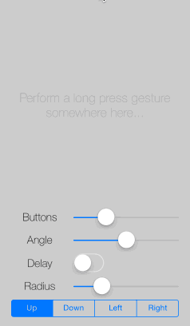
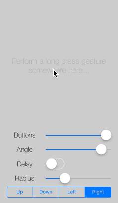
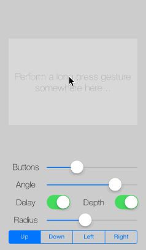

CKCircleMenuView
================

Well, it's a circle menu. Kind of. For iOS.

The idea is to keep your UI simple and clean and show buttons to the user when they are needed. The following screenshot is taken from the demo app I have provided in this repository. Simply clone this repo and call `pod install` within the CircleViewDemo folder. The circle menu is opened via a `UILongPressGesture`. As long as the user holds down his finger, the menu will remain open. Buttons are selected via dragging on the button and releasing the finger.

 &nbsp; 

The following animation shows a depth effect (sorry for the poor gif quality, you have to see this in the demo app!). You can configure a mellow drop shadow to be rendered, which will transform slightly when the button is activated. At the same time, the button will be scaled a bit down, resulting in a super-subtle 3D effect.

If you prefer not to spawn the menu out of nowehere (your users have to know where to long press in order to see the menu) but want to offer a menu button, you can use the `CKCircleMenuView` in _tap mode_. Once opened, the menu stays open until the user selects an option or closes the menu by tapping somewhere else.

The CKCircleMenuView is designed for easy integration and usage. Spawning the menu and reacting on button activations is as easy as to use an ~~UIAlertView~~ (deprecated) UIAlertController.

## Features

There are several options that can be adjusted before presenting the menu.

* Number of buttons (either provided as an array of images or as a dynamic parameter list of images)
* Button's normal color
* Button's active (or say hover) color
* Button's border color
* Angle to be used for button placement (default = 180 degrees)
* Direction of the angle's center (default = `CircleMenuDirectionUp`)
* Radius of the button alignment (default = 65)
* Button's radius (half the width, default = 39)
* Button's border width (default = 2)
* Delay between button animations (default = 0.0 ms)
* Depth effect by using drop shadow and scaling (default = NO)
* Tap mode (default = NO)

## Usage

### CocoaPods

Add `pod 'CKCircleMenuView'` to your Podfile and you are ready to go.

For now, please take a look at the demo app included in this repo to see how the `CKCircleMenuView` is used.

## Author

Christian Klaproth, [@JaNd3r](http://twitter.com/JaNd3r)

## License

CKCircleMenuView is available under the MIT license. See the LICENSE file for more info.
